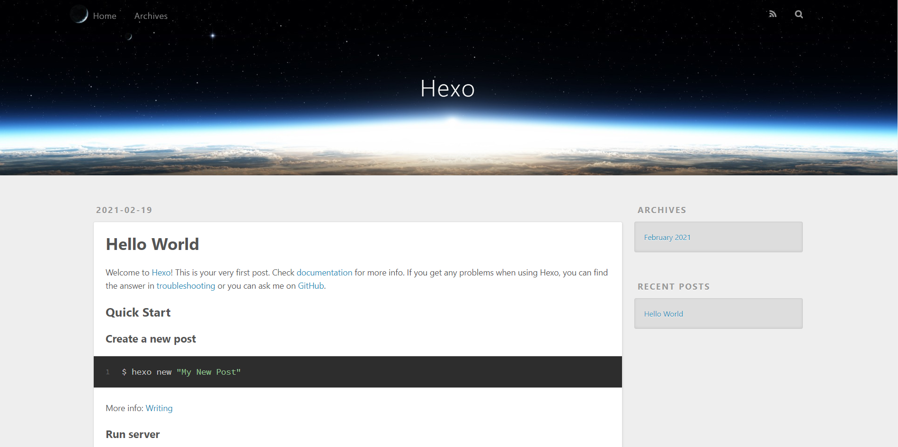

在网上搜索怎么搭建个人博客的时候，也是发现了hexo这个框架，发现里面的主题也是挺丰富的，就尝试了使用hexo搭建自己的博客网站。<!--more-->

## 环境准备

### Node.js

### Git

### hexo

```sh
$ npm install -g hexo-cli
```

## 开始工程

### 初始工程文件

在自己想要放置项目工程的地方打开命令行，执行：

```shell
$ hexo init myblog
```

执行完后会在该目录下创建一个myblog文件夹，即初始化moblog文件夹为hexo项目工程目录，里面存放着hexo的相关文件。

### 生成静态文件

```shell
$ hexo generate
```

或者

```shell
$ hexo g
```

### 运行服务器

```shell
$ hexo srever
```

或者

```shell
$ hexo s
```

在浏览器中输入相应网址就能看到效果啦，当然看到的是自带的主题的效果。

### 创建新的文章

```shell
$ hexo new post "name"
```

### 安装新主题

hexo中可以更换新主题，前往[hexo主题](https://hexo.io/themes/)挑选自己喜欢的主题，一般都会有相应的安装教程。我使用的NexT主题，按照[GitHub教程](https://github.com/next-theme/hexo-theme-next)就可以完成主题的配置了。

例如NexT主题：

1. 进入到工程目录

2. 运行

   ```shell
   npm install hexo-theme-next
   ```

   或者

   ```shell
   git clone https://github.com/next-theme/hexo-theme-next themes/next
   ```

   运行之后就会在工程目录的themes中多出next文件夹；

3. 在项目工程目录中_config.yml文件中找到theme，更改为：

   ```yaml
   theme: next
   ```

4. 将themes/next中的\_config.yml文件复制到项目根目录中，重命名为\_config.next.yml，注意不要替换原始的hexo的配置文件_config.yml，以后的更改在\_config.next.yml中更改就行；

## 个性设置

### 设置头像

在config.next.yml文件中找到avatar，更改为：

```yaml
avatar:
  # Replace the default image and set the url here.
  url: /images/pikaqiu.png
  # If true, the avatar will be dispalyed in circle.
  rounded: true
  # If true, the avatar will be rotated with the cursor.
  rotated: true
```

将图片放在themes/next/source/images文件夹中。

### 添加动态线条背景

如果主题配置文件_config.next.yml中有canvas_nest的话，直接改为true就行；

如果没有的话，在_config.next.yml中添加

```yaml
canvas_nest: true
```

然后在themes/next/layout/_layout.njk中body标签的最后面，也就是\</body\>前面添加

```js

<script type="text/javascript" src="//cdn.bootcss.com/canvas-nest.js/1.0.0/canvas-nest.min.js"></script>

```

或者添加线条的其他属性：

```js

  <script type="text/javascript" color="255,0,255" opacity='0.5' zIndex="-2" count="100" src="//cdn.bootcss.com/canvas-nest.js/1.0.0/canvas-nest.min.js"></script>
  
```

* color：颜色属性，默认"0,0,0"
* opacity：线条透明度，默认0.5
* count：线条总数量，默认150
* zIndex：z-index属性，默认-1

### 添加点击特效

在themes/next/source/js/src中新建clicklove.js文件，没有src文件夹的话建一个也行，添加代码

```js
!function(e,t,a){function n(){c(".heart{width: 10px;height: 10px;position: fixed;background: #f00;transform: rotate(45deg);-webkit-transform: rotate(45deg);-moz-transform: rotate(45deg);}.heart:after,.heart:before{content: '';width: inherit;height: inherit;background: inherit;border-radius: 50%;-webkit-border-radius: 50%;-moz-border-radius: 50%;position: fixed;}.heart:after{top: -5px;}.heart:before{left: -5px;}"),o(),r()}function r(){for(var e=0;e<d.length;e++)d[e].alpha<=0?(t.body.removeChild(d[e].el),d.splice(e,1)):(d[e].y--,d[e].scale+=.004,d[e].alpha-=.013,d[e].el.style.cssText="left:"+d[e].x+"px;top:"+d[e].y+"px;opacity:"+d[e].alpha+";transform:scale("+d[e].scale+","+d[e].scale+") rotate(45deg);background:"+d[e].color+";z-index:99999");requestAnimationFrame(r)}function o(){var t="function"==typeof e.onclick&&e.onclick;e.onclick=function(e){t&&t(),i(e)}}function i(e){var a=t.createElement("div");a.className="heart",d.push({el:a,x:e.clientX-5,y:e.clientY-5,scale:1,alpha:1,color:s()}),t.body.appendChild(a)}function c(e){var a=t.createElement("style");a.type="text/css";try{a.appendChild(t.createTextNode(e))}catch(t){a.styleSheet.cssText=e}t.getElementsByTagName("head")[0].appendChild(a)}function s(){return"rgb("+~~(255*Math.random())+","+~~(255*Math.random())+","+~~(255*Math.random())+")"}var d=[];e.requestAnimationFrame=function(){return e.requestAnimationFrame||e.webkitRequestAnimationFrame||e.mozRequestAnimationFrame||e.oRequestAnimationFrame||e.msRequestAnimationFrame||function(e){setTimeout(e,1e3/60)}}(),n()}(window,document);

```

然后在themes/next/layout/_layout.njk中body标签的最后面，也就是\</body\>前面添加

```js
<script type="text/javascript" src="/js/src/clicklove.js"></script>
```

当然还有其他点击特效也可以自己去找。

### 添加页面看板娘

在项目工程目录中执行：

```shell
npm install -save hexo-helper-live2d
```

在[live2d](https://github.com/xiazeyu/live2d-widget-models)网站中找到自己喜欢的看板，然后下载，我使用的z16，执行

```shell
npm install live2d-widget-model-z16
```

下载好对应的模型；

然后在项目配置文件_config.yml最后面添加：

```yaml
live2d:
  enable: true
  scriptFrom: local
  pluginRootPath: live2dw/
  pluginJsPath: lib/
  pluginModelPath: assets/
  tagMode: false
  model:
    use: live2d-widget-model-z16  #选择哪种模型
  display: #放置位置和大小
    position: left
    width: 150
    height: 300
  mobile:
    show: false #是否在手机端显示
```

我个人觉得比较好看的几个看板：

* hibiki
* epsilon2_1
* koharu
* live2d-widget-model-tororo

